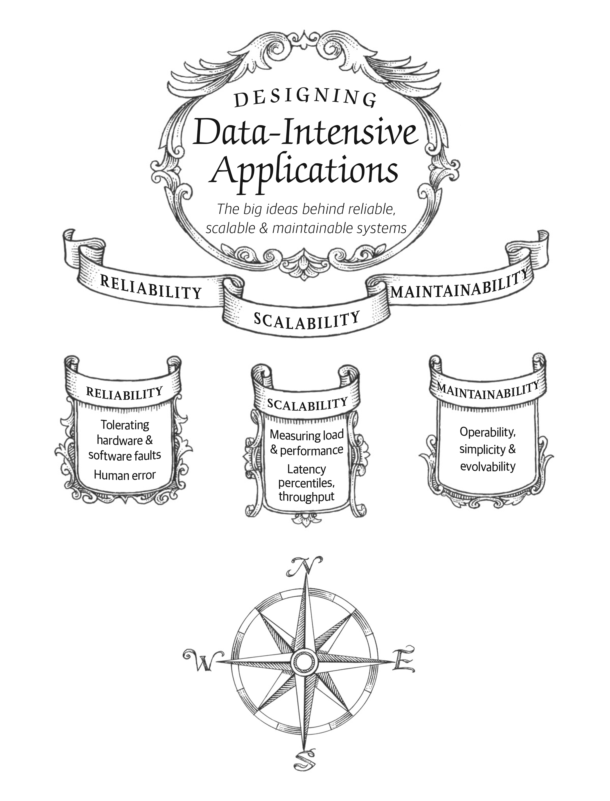

# data-intensive-application-book-reading

https://learning.oreilly.com/library/view/designing-data-intensive-applications/9781491903063/ch01.html

Many applications today are data-intensive, as opposed to compute-intensive. Raw CPU power is rarely a limiting factor for these applications—bigger problems are usually the ***amount of data, the complexity of data, and the speed at which it is changing***.

A data-intensive application is typically built from standard building blocks that provide commonly needed functionality. For example, many applications need to:

1) Store data so that they, or another application, can find it again later ***(databases)***

2) Remember the result of an expensive operation, to speed up reads ***(caches)***

3) Allow users to search data by keyword or filter it in various ways ***(search indexes)***

4) Send a message to another process, to be handled asynchronously ***(stream processing)***

5) Periodically crunch a large amount of accumulated data ***(batch processing)***

--------------------------------------------------------------------------------------------------------------------

In this chapter, we will start by exploring the fundamentals of what we are trying to achieve: ***reliable, scalable, and maintainable data systems***.

##### Thinking About Data Systems
We typically think of databases, queues, caches, etc. as being very different categories of tools. Although a database and a message queue have some superficial similarity—both store data for some time—***they have very different access patterns, which means different performance characteristics, and thus very different implementations.***

So why should we lump them all together under an umbrella term like data systems?

Many new tools for data storage and processing have emerged in recent years. They are optimized for a variety of different use cases, and they no longer neatly fit into traditional categories [1]. For example, there are datastores that are also used as message queues (Redis), and there are message queues with database-like durability guarantees (Apache Kafka). The boundaries between the categories are becoming blurred.

Secondly, increasingly many applications now have such demanding or wide-ranging requirements that a single tool can no longer meet all of its data processing and storage needs. Instead, the work is broken down into tasks that can be performed efficiently on a single tool, and those different tools are stitched together using application code.

For example, if you have an application-managed caching layer (using Memcached or similar), or a full-text search server (such as Elasticsearch or Solr) separate from your main database, it is normally the application code’s responsibility to keep those caches and indexes in sync with the main database.

If you are designing a data system or service, a lot of tricky questions arise. How do you ensure that the data remains correct and complete, even when things go wrong internally? How do you provide consistently good performance to clients, even when parts of your system are degraded? How do you scale to handle an increase in load? What does a good API for the service look like?

In this book, we focus on three concerns that are important in most software systems:

#### 1) Reliability
The system should continue to work correctly (performing the correct function at the desired level of performance) even in the face of adversity (hardware or software faults, and even human error).

#### 2) Scalability
As the system grows (in data volume, traffic volume, or complexity), there should be reasonable ways of dealing with that growth.

#### 3) Maintainability
Over time, many different people will work on the system (engineering and operations, both maintaining current behavior and adapting the system to new use cases), and they should all be able to work on it productively

-------------------------------------------------------------------------------------------------------------

